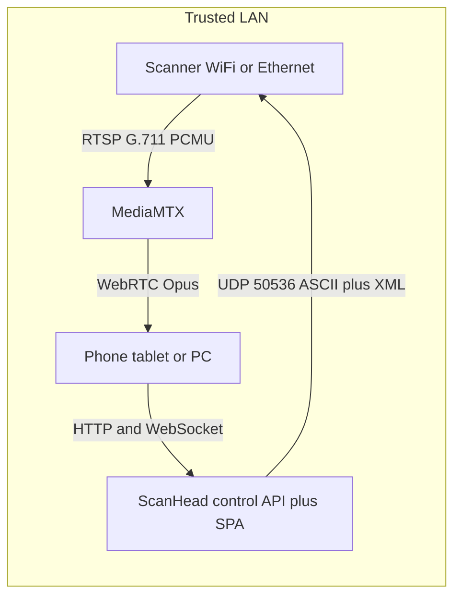

# ScanHead plan

ScanHead turns a network-connected Uniden scanner into a **browser-based remote head**. It is a modern, self-hosted replacement for Uniden’s Siren app. Run it on a trusted LAN, point it at a supported scanner, and use any modern browser for live audio, the scanner’s display, physical keys, favorites, quick keys, and menus.

Unlike a scanner audio streamer, ScanHead implements a full remote head: the browser mirrors the scanner’s display and provides its physical controls, favorites, quick keys, and menu navigation.

Audio and control are separate paths:

- Scanner → RTSP audio → ScanHead (MediaMTX) → WebRTC → browser
- Browser → ScanHead (control API) → ASCII/XML commands → scanner

The scanner’s remote-control and audio interfaces do not provide authentication. ScanHead is designed for **trusted LAN deployments** and should not be exposed directly to the Internet. “LAN-only” here is a deployment assumption, not a claim that the app refuses WAN access.

Repo: `scanhead`. Compose project / UI title: ScanHead.

## Scanner support (v1)

| Scanner | Network audio / control | v1 |
|---|---|---|
| **BCD536HP** | Wi-Fi, RTSP + UDP 50536 | Primary target |
| UBCD536PT | Wi-Fi, RTSP + UDP 50536 | Compatible (EU 536) |
| **SDS200** | Ethernet, RTSP + UDP 50536 | First-class target |
| SDS200E / USDS200 | Ethernet, RTSP + UDP 50536 | Expected compatible |
| BCD436HP / UBCD436PT | USB serial (no RTSP) | Future USB backend |
| SDS100 / SDS100E / USDS100 | USB serial (no RTSP) | Future USB backend |
| SDS150 | USB serial (same SDS commands); phone app is BLE/U-AWARE | USB future; U-AWARE not a ScanHead backend |

Handhelds share the command family but have no native RTSP for ScanHead to proxy. USB support would be a later, separate backend.

**Out of scope:** HomePatrol-1/2, BCD996P2 / BCD325P2 / XT and other Bearcats, analog-only Uniden, Whistler — different interfaces and protocols.

## Why the headphone-to-PC path failed

The scanner already exposes **digital audio over the network**. An analog tap from the headphone jack is a second conversion (DAC → ADC) with level/impedance issues. The intended path is:

```text
rtsp://<scanner-ip>/au:scanner.au
```

Codec is **G.711 µ-law (PCMU)** over RTSP/RTP. Browsers cannot play RTSP, so a small proxy must sit on the LAN, take **one** client slot on the scanner, and re-publish to phones/PCs as WebRTC (low latency) or HLS.

Uniden documents this for VLC on [BCD536HP Wi-Fi Firmware Instructions](https://info.uniden.com/twiki/bin/view/UnidenMan4/BCD536HPFirmwareUpdate).

## Target architecture



Two containers, one compose file, Linux Docker host on the **same LAN** as the scanner (DHCP reservation for the scanner IP).

| Service | Role |
|---|---|
| **MediaMTX** | Sole RTSP client of the scanner. Republish as WebRTC (primary) and HLS (fallback). Docker image `bluenviron/mediamtx`. Uniden SDS200 RTSP SSRC quirks were fixed in MediaMTX **v0.20.1+**; use a current tag. |
| **app** | FastAPI (Python) + small SPA. Owns the UDP control socket. Serves the UI, WebSocket live status, and REST for keys/lists/menus. |

**Host networking** (or equivalent) is required on Linux. The scanner’s RTP uses **dynamic UDP ports**; Docker bridge NAT commonly breaks that. MediaMTX can try RTSP interleaved TCP (`sourceProtocol: tcp`) as a fallback if the dongle accepts it.

**One controller.** Do not run Siren, ProScan, or RH-536HP at the same time. ScanHead is the only `PSI` subscriber.

Optional HTTP basic auth / reverse-proxy auth later. That would gate the web UI; it does not add auth to the scanner itself.

## Technical background

ScanHead uses Uniden’s published ASCII/XML remote-command protocol for the HomePatrol/SDS family, including commands such as `KEY`, `GLT`, `MNU`, `GSI`, and `PSI`. SDS documentation describes this as an extension of the [BCDx36HP Remote Command Specification v1.05](https://info.uniden.com/twiki/pub/UnidenMan4/BCD536HPFirmwareUpdate/BCDx36HP_RemoteCommand_Specification_V1_05.pdf). ScanHead uses `MDL` to identify the connected scanner and adapt the remote UI (key maps, extra SDS commands). Menu structure follows the [UB375Z Menu Tree Specification v1.07](https://info.uniden.com/twiki/pub/UnidenMan4/BCD536HPFirmwareUpdate/BCDx36HP_MenuTreeSpecification_V1_07.pdf).

Control is **UDP port 50536** (SDS200 virtual-serial spec: “for compatibility with BCD536HP”). ASCII commands, CR-terminated, no handshake and no header. Status is XML via `GSI` (one-shot) and `PSI` (periodic push; interval is a command parameter). Large XML (`GSI`/`PSI`/`GLT`/`MSI`) is split across UDP packets; reassemble using the `Foot` node (`No` for sequence, `EOT` for last packet) and retry on gaps.

The official **Siren** app is limited to selected phones and tablets. Commercial **ProScan** already does web server + stream + control on Windows. Open-source pieces exist (`LinScan-536` is a Linux GUI over **USB serial**; `chuot/rc-scanner` is a PWA over **serial**, BCD436HP). None is a dockerized Wi-Fi remote-head clone. The protocol is complete enough to build one.

## UI as a remote head

Not a pixel clone of the front panel. A tablet-first web UI that uses the **same data Siren used**:

1. **Listen + live radio view** — system / department / channel / TGID, frequency, modulation, RSSI/Sig, P25/DMR/NXDN status, volume, squelch, mute, avoid, hold. Driven by `PSI` XML (`ScannerInfo`, `Property`, `System`, `Department`, `TGID`, `ConvFrequency`, `ViewDescription` popups).
2. **Everyday controls** — `KEY` (keypad, menu, hold, avoid, replay, rotary `>`/`<`/`^`, vol/squelch knobs). Example: Yes is `KEY,E,P`. Also first-class buttons for `HLD`, `NXT`, `PRV`, `AVD` (permanent / temporary / stop).
3. **Favorites / systems / departments / TGIDs** — `GLT,FL` then `GLT,SYS,<fl>` / `GLT,DEPT,<sys>` / `GLT,TGID,<dept>` / etc. Indexes from `GLT` are the handles for hold/avoid. Quick keys via `FQK` / `SQK` / `DQK`. Number-tag jump via `JNT`.
4. **Mode jumps** — `JPM` for scan, Close Call, weather, fire tone-out, replay, discovery.
5. **Menus** — `MNU` to enter a menu, `MSI` XML for current items (`TypeSelect` / `TypeInput` / `TypeLocation` / `TypeError`), `MSV` to set a value, `MSB` to go back. Menu IDs include `TOP`, `MONITOR_LIST`, `SCAN_SYSTEM`, `SETTINGS`, `WX`, `CC`, etc. Structure follows the Menu Tree spec; the UI is a generic menu renderer, not 200 hardcoded screens.
6. **Replay / user recording** — `URC` start/stop; `GLT,IREC_FILE` / `GLT,UREC` / `GLT,UREC_FILE`.
7. **Location / clock / service types** — `LCR`, `DTM`, `SVC` (lower priority than the scan UI).

Out of Wi-Fi scope: `AST,RAW_DATA_OUTPUT` is **USB-only**. Sentinel programming / HPDB updates stay on USB + Sentinel.

## Implementation sketch

Suggested layout:

- `compose.yaml` — project name `scanhead`; services `mediamtx` + `app`; env `SCANNER_IP`
- `mediamtx.yml` — path `scanner` sourced from `rtsp://$SCANNER_IP/au:scanner.au`
- `app/` — UDP client, XML reassembly, FastAPI, static SPA
- `docs/protocol.md` — command cheat sheet + links to Uniden PDFs

**Audio:** MediaMTX WHEP/WebRTC in the page (low latency, good quality vs analog tap). HLS as fallback for picky browsers.

**Control plane:** one asyncio UDP socket; serialize commands; reassemble multi-packet XML; push parsed `PSI` over WebSocket; REST for `KEY`/`HLD`/`GLT`/`MNU`/….

**Stack rationale:** Python for XML + async UDP; MediaMTX instead of a custom FFmpeg/WebSocket audio path (Uniden RTSP is non-standard; MediaMTX already absorbed SDS200 quirks).

## Phased delivery

Do this in order so hardware is proven before UI work:

1. **Lab proof (no app)** — scanner on infrastructure Wi-Fi with a reserved IP; VLC plays `rtsp://IP/au:scanner.au`; a one-shot UDP `MDL\r` / `VER\r` / `GSI\r` to port 50536 returns model + XML. If this fails, the docker app cannot help.
2. **Stream-only compose** — MediaMTX + a page with a play button. Several browsers listening at once (scanner sees one RTSP client).
3. **Live display + keypad** — `PSI` + `KEY` + volume/squelch + hold/skip/avoid.
4. **Lists and quick keys** — `GLT` tree, `FQK`/`SQK`/`DQK`, `JNT`.
5. **Menu engine** — `MNU`/`MSI`/`MSV`/`MSB` generic renderer.
6. **Replay, discovery, weather, tone-out, location.**

## Hardware / ops constraints

- Scanner firmware + Wi-Fi dongle firmware current (Sentinel → Update Firmware).
- Infrastructure (station) mode, not AP mode, unless you want a dedicated scanner SSID.
- Same L2/L3 as the Docker host; do not hairpin through WAN.
- Exclusive control session; exclusive RTSP pull (MediaMTX is the puller).
- Quality will be G.711 (8 kHz telephony) **transcoded** to Opus for the browser — far cleaner than a headphone tap, but not FM-broadcast hi-fi.
- Do not publish ScanHead or the scanner’s UDP/RTSP ports on the public Internet.
